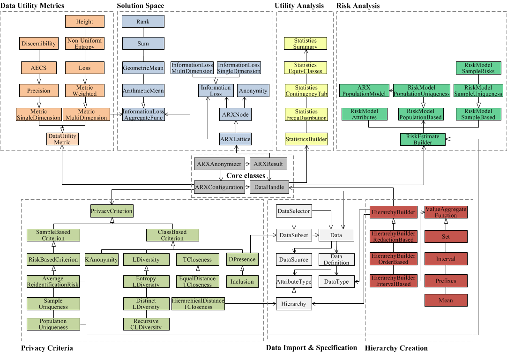

# ARX API Architecture

## Introduction

ARX is an open source tool that helps to protect personal data by transforming structured datasets using various privacy models and data transformation schemes. The tool can remove direct identifiers and enforce constraints on indirect identifiers, which can be used for linkage attacks. ARX also supports methods to protect sensitive attributes and semantic privacy models that require fewer assumptions about attackers.

ARX allows almost any combination of privacy models and data transformation schemes, such as global and local transformation schemes, random sampling, generalization, record, attribute and cell suppression, microaggregation, top- and bottom-coding, and categorization. It also supports various data quality models and objective functions to measure the data granularity, deviation in value distributions, uniqueness and ambiguity of records, and suitability of output data for classification models.

ARX provides methods to create data transformation rules, analyze data utility, estimate re-identification risks, identify quasi-identifying variables, and iteratively adjust anonymization parameters in a semi-automated process.

## API Documentation

ARX API was selected for the purpose of anonymizing data due to its well-structured code and ease of use. Additionally, it comes with comprehensive documentation, including an online javadoc with all the packages and classes in the API. The main objective of this programming interface is to offer de-identification techniques to other software systems. When it comes to the anonymization process, the key classes include `ARXConfiguration`, `ARXAnonymizer`, and `ARXResult`.

The `ARXConfiguration` is responsible for setting various parameters (e.g. privacy model, suppression rate) that are sent to the `ARXAnonymizer`. By allowing multiple parameters, users can create customized de-identified datasets. The `ARXAnonymizer` provides various methods for defining these parameters and executing the ARX algorithm based on the configuration provided by `ARXConfiguration`. The resulting output is of the type `ARXResult`, which is then presented to the user. Additionally, the `ARXResult` class includes several useful methods, such as information about execution time and information loss.

## Roadmap

### `/anon/uploadSource`

- Method: `POST`
- Input Format: `multipart/form-data`
- Input Parameters:
  - `"file"`: A file to be uploaded
- Output Format: `text/plain`
- Output: A message indicating that the data source has been uploaded

### `/anon/uploadConfig`

- Method: `POST`
- Input Format: `application/json`
- Input Parameters:

  - `"attributes"`: An array of JSON objects representing attributes of the data source, e.g.

    '''

    [
    {
    "attribute_name": "Age",
    "attributeType": "Sensitive",
    "DataType": "Integer"
    },
    {
    "attribute_name": "Name",
    "attributeType": "Quasi-Sensitive",
    "DataType": "String"
    }
    ]

    '''

  - `"privacy_config"`: A JSON object representing the privacy configuration, e.g.

    '''
    {
    "k": "5",
    "model": "k-anonymity",
    "rate": "0.3"
    }
    '''

- Output Format: `text/plain`
- Output: A message indicating that the configuration has been uploaded

### `/anon/uploadHierarchy`

- Method: `POST`
- Input Format: `multipart/form-data`
- Input Parameters:
  - `"file"`: A file to be uploaded
- Output Format: `text/plain`
- Output: A message indicating that the hierarchy has been uploaded

### `/anon/anonymize`

- Method: `POST`
- Endpoint: `/anonymize`
- Input Format: `application/json`
- Input Parameters:
  - `"data"`: The name of the CSV file to be anonymized, located in the path directory.
- Output Format: `text/plain`
- Output: A message indicating that the anonymization process has been completed.
- Response: A 200 OK HTTP response is returned with a message indicating the completion of the anonymization process.

### `/anon/getResult`

- Method: `GET`
- Endpoint: `/getResult`
- Output Format: `application/octet-stream`
- Output: The CSV file containing the anonymized dataset.
- Response: A 200 OK HTTP response is returned with the CSV file containing the anonymized dataset as a stream. The response includes the Content-Disposition header that specifies the filename of the CSV file.

:::info
Note: All APIs respond with appropriate CORS headers to allow cross-origin resource sharing.
:::
