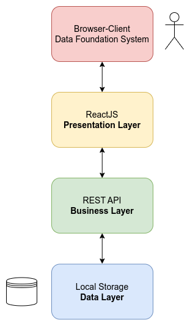

# Web App Architecture

## Introduction

To provide structure to the web application, a layered architecture was devised, which divides the various components into distinct sections. This layered separation is a commonly used approach for web platforms. In this particular architecture, the application is separated into three tiers or layers, each of which has a unique role in processing. These layers are known as the "Presentation Tier," "Business Tier," and "Data Tier."

The "Presentation Tier" is responsible for handling the user interface, allowing users to interact with the web application. This layer is typically built using front-end technologies such as HTML, CSS, and JavaScript. It provides a user-friendly interface that enables users to input and retrieve data.

The "Business Tier" is responsible for processing the data entered by the user and performing complex operations on it. It acts as the intermediary between the presentation layer and the data layer. The business tier handles all the application's business logic and rules, such as calculations, validations, and workflows.

The "Data Tier" is responsible for storing and retrieving data from the database. It stores all the data required by the application and makes it available to the business tier for processing. The data tier typically consists of a database management system and the associated tools required to manipulate the data.

Aggregating all three tiers in a single framework simplifies the interconnection process, making it easier to manage and maintain the application. Additionally, this separation of concerns allows for each layer to be developed, tested, and maintained independently, making it easier to scale and modify the application over time.

### Presentation Tier

The Presentation Layer contains user-oriented functionalities and manages user interaction with the system. It acts as a bridge to the Business Layer and allows users to interact with the application. Typically, it consists of components such as HTML, CSS, JavaScript, and jQuery, which run on the client-side of the browser. The Presentation Layer communicates with the Business Layer through REST API (JAX-RS) and utilizes LocalStorage for temporary data storage.

### Business Tier

The Business Tier implements the core functionality of the system and encapsulates the relevant business logic. It separates the execution of business rules from the user interface and data access. This layer typically consists of elements that execute rules and processes the data received from the Presentation Layer before passing it on to the Data Tier. The Business Tier communicates with the other layers through APIs and services.

### Data Tier

The Data Tier provides access to the databases and storage devices used by the application. Its primary function is to retrieve data from the database and transform it into a suitable format for the rest of the application. It stores and retrieves information from the Business Tier for processing and ultimately provides it to the Presentation Tier. Typically, the Data Tier utilizes database management systems such as MySQL, MongoDB, or Cassandra to store and retrieve data.

In some cases, such as when using the ARX API, there may not be a need to use a database, as saving the files locally may be sufficient to perform the anonymization process. However, the Data Tier still provides the necessary data retrieval and transformation functions required by the other layers.

By separating the application's functionality into distinct layers, the layered architecture provides greater flexibility, scalability, and maintainability. Each layer can be developed and maintained independently, allowing for easier testing, debugging, and modification. Additionally, the separation of concerns between the layers reduces the complexity of the application and makes it easier to understand and manage.
