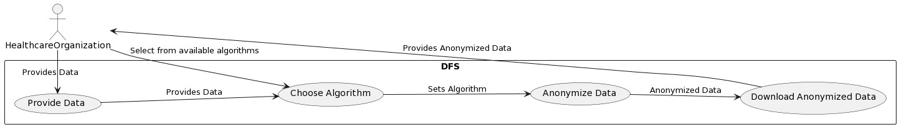
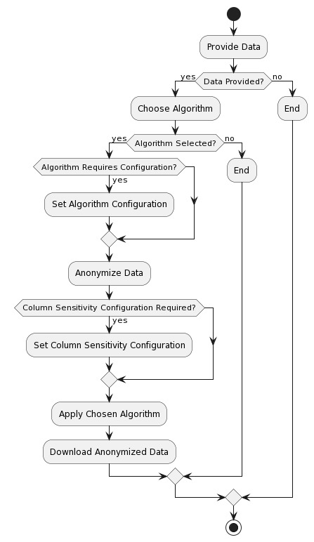
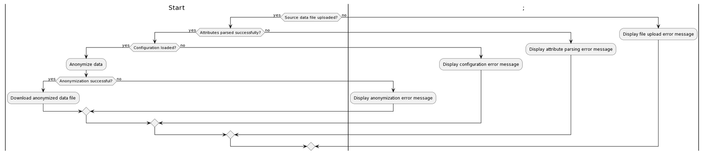
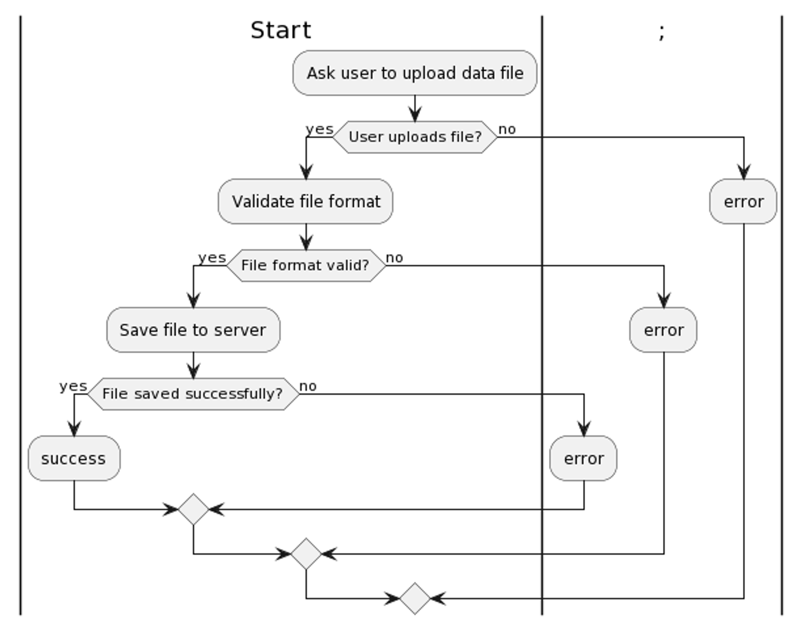

# The Project

**Ashe is a data anonymisation solution for relational databases in healthcare.** It is designed to protect patient privacy by effectively anonymizing patient information while preserving the integrity and meaning of the data. Ashe is built using React and Node, and integrates with the current Data Foundation systems to ensure ease of use and a seamless user experience.

## Abstract

Healthcare organizations increasingly rely on electronic health records (EHR) to manage patient information. As a result, protecting patient privacy has become a critical issue, and data anonymisation is essential to ensuring patient confidentiality. This project aims to develop a data anonymisation solution for relational databases in healthcare. The proposed solution will address the variety of data types present in healthcare, including both categorical and real-valued data, to effectively anonymize information while preserving the integrity and meaning of the data.

## Scope

The project scope encompasses the following key objectives:

- Conduct a comprehensive review of existing data anonymisation methods and select the most appropriate techniques for relational databases in healthcare.
- Develop a software solution that implements the selected anonymisation techniques.
- Evaluate the performance and effectiveness of the solution through testing and validation using real-world healthcare data sets.
- Provide detailed technical documentation of the solution, including design, implementation, testing, and validation results.

## Methodology

We will take the following steps to complete the project:

1. Review of existing data anonymisation techniques and selection of the most appropriate methods.
2. Design and implementation of the software solution using React and Node.
3. Testing and validation of the solution using real-world healthcare data sets.
4. Documentation of the solution and the evaluation results.

## Timeline

The project timeline is estimated to be 2-3 months, with the following milestones:

1. Review of existing data anonymisation techniques: 2 weeks
2. Design and implementation of the solution: 7 weeks
3. Testing and validation: 2 weeks
4. Documentation and report writing: 1 week

## Scalability and Integration

The proposed solution will be scalable to accommodate future growth and demand, ensuring that it can handle larger data sets and support increased usage by healthcare organizations. It will also be designed to integrate seamlessly with existing Data Foundation systems to ensure ease of use and a seamless user experience.

## Impact

The implementation of this project will significantly impact the healthcare industry by providing a solution for protecting patient privacy through the effective anonymisation of relational databases. This solution will help healthcare organizations meet privacy regulations and ensure the confidentiality of sensitive patient information.

## Requirements

The following requirements have been identified for the data anonymisation solution for relational databases in healthcare:

### Functional Requirements

- Ability to **handle various data types**, including categorical and real-valued data.
- Implementation of multiple data anonymisation techniques to effectively anonymize patient information while **preserving the integrity and meaning of the data**.
- Integration with existing Data Foundation systems for ease of use and a seamless user experience.
- Ability to handle large data sets and accommodate future growth and demand.
- Compliance with privacy regulations and standards, such as GDPR.
- User-friendly interface for easy configuration and management of data anonymisation settings.

### Non-Functional Requirements

- **Performance**: The solution must process data in a timely and efficient manner, with minimal impact on system performance.
- **Security**: The solution must ensure the confidentiality of patient information and protect against unauthorized access or breaches.
- **Scalability**: The solution must be designed to scale to accommodate future growth and demand.
- **Reliability**: The solution must be reliable, with minimal downtime or errors.
- **Maintainability**: The solution must be easily maintainable, with clear documentation and code structure.
- **Usability**: The solution must be user-friendly, and easy to use, with clear and concise instructions and guidance.

### Representation

### Traceability

|                              **Requirement**                               |                                    **Design**                                     |                                               **Implementation**                                                |                                                         **Testing**                                                         |
| :------------------------------------------------------------------------: | :-------------------------------------------------------------------------------: | :-------------------------------------------------------------------------------------------------------------: | :-------------------------------------------------------------------------------------------------------------------------: |
|                      R1: User can upload a data file                       | S1: Ask user to upload data file S2: Validate file format S3: Save file to server | C1: Implement file upload form C2: Implement file validation logic C3: Implement file storage and retrieval API | T1: Test file upload functionality T2: Test file validation functionality T3: Test file storage and retrieval functionality |
|          R2: System can parse attributes hierarchy and data types          |                   S4: Parse attributes hierarchy and data types                   |                                    C4: Implement attribute parsing algorithm                                    |                                          T4: Test attribute parsing functionality                                           |
|              R3: System can load user-specified configuration              |                              S5: Load configuration                               |                              C5: Implement configuration loading and parsing logic                              |                                  T5: Test configuration loading and parsing functionality                                   |
| R4: System can anonymize data based on hierarchy, types, and configuration |                                S6: Anonymize data                                 |                                   C6: Implement data anonymization algorithm                                    |                                          T6: Test data anonymization functionality                                          |
|                 R5: User can download anonymized data file                 |                         S7: Download anonymized data file                         |                                  C7: Implement file download and streaming API                                  |                                     T7: Test file download and streaming functionality                                      |

## Activity Diagrams

1. `Upload source data file`: The user uploads a source data file to the system. The file should be in csv format.

2. `Parse attributes hierarchy and data types`: The system parses the uploaded data file to determine the hierarchy and data types of the attributes. The system set default automatic values for the data types/sensitivity types, or the user may manually specify them.

3. `Load configuration`: The system loads the configuration specified by the user or uses default settings for anonymizing data. The configuration includes supression rate and model (k-anonymity, l-diversity, t-closeness).

4. `Anonymize data`: The system anonymizes the data based on the parsed attributes hierarchy, data types, and configuration. This involves masking or transforming certain attributes or data types.

5. `Download anonymized data file`: The anonymized data is downloaded by the user in the form of a file. The file is in csv format as the uploaded data file.

6. `End`: The process ends. The system performs cleanup tasks, such as deleting temporary files or closing database connections.

### User Configuration

The process begins with a `Start` node and includes the following steps:

1. `Ask user to upload data file`: The system prompts the user to upload a data file. The system will then show the metadata along with data for the file

2. `Validate file format`: The system checks whether the file format is valid. This may involve checking the file extension, file type header, and other file metadata.

3. `Save file to server`: If the file format is valid, the system saves the file to the server. This involves creating a file in specified directory for the uploaded file and setting appropriate file permissions.

4. `Success`: If the file is saved successfully, it is a success and system provides options for the user to re-upload the file.

5. `End`: The process ends. The system performs cleanup tasks, such as deleting temporary files or closing database connections.

### Data Upload

1. `Ask user to upload data file:` The system prompts the user to upload a data file. This may involve displaying a web form with input fields for the file name, description, and metadata. The system also provides a file picker dialog for the user to select the file from their local file system.

2. `Validate file format`: The system checks whether the file format is valid. This involves checking the file extension, file type header, and other file metadata.

3. `Save file to server`: If the file format is valid, the system saves the file to the server. This involvse creating a new file in specified directory for the uploaded file and setting appropriate file permissions.

4. `Display success message`: If the file is saved successfully, it is a success and involves redirecting the user to a new page.

5. `End`: The process ends. The system performs cleanup tasks, such as deleting temporary files or closing database connections.
