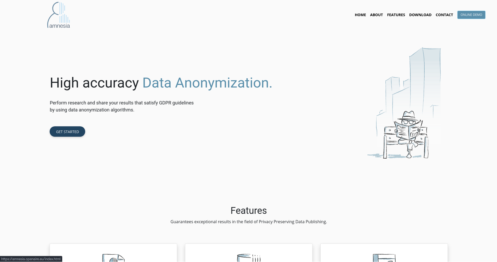

# Amnesia

Link: [Amnesia](https://amnesia.openaire.eu/index.html)

## Introduction

Amnesia is a high-accuracy data anonymization tool developed by OpenAIRE-Advance. This tool is designed to allow users to perform research and share their results while satisfying the General Data Protection Regulation (GDPR) guidelines. Amnesia uses data anonymization algorithms to transform personal data into anonymous data that can be used for statistical analysis.

## Features

- Guarantees exceptional results in Privacy Preserving Data Publishing
- Offers k-anonymity and km-anonymity for no links to the original data
- Allows minimal reduction of information quality
- Guarantees anonymity and goes beyond pseudo-anonymization
- GDPR does not constrain anonymized data
- High usability and flexibility with an easy-to-use graphical interface

## Working process

Amnesia offers a three-step approach to anonymize data. Firstly, the user inserts their data in a delimited text file format. Secondly, the user selects and previews the data to anonymize and adjusts the anonymization parameters through a visual representation. Finally, the user downloads the anonymized data without any sensitive data leaving their premises.

## Use Cases

Amnesia has been applied in various industries, including healthcare and data privacy training courses. It was used in the EU "My Health My Data" project to support an ecosystem for safely exchanging medical data. Additionally, Amnesia was used during the European Commission's EUvsVirus Hackathon for Covid-19 data anonymization.

## Conclusion

Amnesia is a high-accuracy data anonymization tool that guarantees exceptional results in Privacy Preserving Data Publishing while satisfying GDPR guidelines. The tool offers a user-friendly graphical interface with adjustable settings and a three-step process to anonymize data. Amnesia has been applied in various industries and is continuously updated to improve its functionality.
