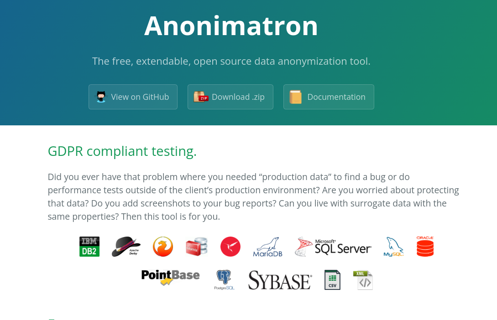

# Anonimatron

Link: [sdcMicro](https://cran.r-project.org/package=sdcMicro)

## Introduction

Anonimatron is a data anonymization tool that helps users maintain the privacy of individuals in datasets. Anonimatron pseudonymizes datasets, allowing users to anonymize data in databases and files. The tool is designed to be easy to configure, automatically generating an example config file, and is extendable, allowing users to implement and add their own anonymization handlers.

## Features

- Supports pseudonymization of datasets
- Anonymizes data in databases and files
- Generates fake email addresses, fake Roman names, and UUID’s out of the box
- Easy to configure, automatically generates example config file
- Anonymized data is consistent between runs
- Extendable, easily implement and add your own anonymization handlers

## Working Process

Anonimatron uses pseudonymization to transform sensitive data into anonymous data. The user inputs the sensitive data into Anonimatron, and the tool pseudonymizes the data. The user has the option to configure the tool to generate fake email addresses, fake Roman names, and UUID’s out of the box, making it easy to anonymize data. Anonimatron also provides users with the ability to extend the tool by adding their own anonymization handlers.

## Use Cases

Used in GDPR compliant testing

## Conclusion

Anonimatron is a powerful data anonymization tool that helps users maintain the privacy of individuals in datasets. The tool is easy to configure and extendable, making it a valuable tool for anyone looking to anonymize data in a privacy-preserving manner
