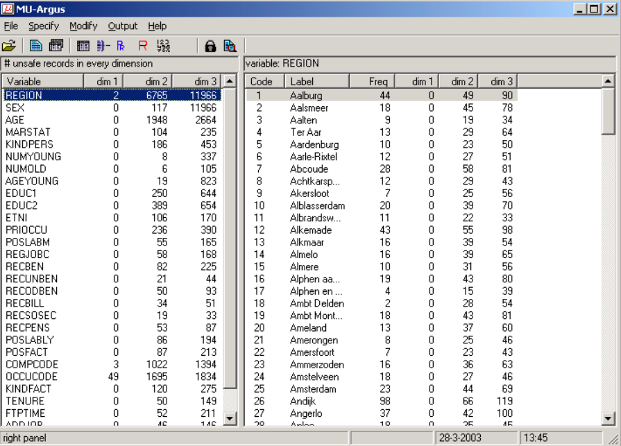

# µ-ARGUS

Link: [µ-ARGUS](https://research.cbs.nl/casc/mu.htm)

## Introduction

µ-ARGUS is a statistical data anonymization tool developed to ensure data privacy while still allowing for data analysis and sharing. It supports a range of anonymization methods to transform sensitive data into anonymous data for statistical analysis.

## Features

µ-ARGUS supports several statistical anonymization methods, including global recoding (grouping of categories), local suppression, randomization, adding noise, microaggregation, top- and bottom coding, and the ability to generate synthetic data.

### Global Recoding

Global recoding involves grouping similar categories together to reduce the granularity of the data and protect sensitive information. This method is useful when the data has a large number of categories and protecting the privacy of individuals would require reducing the granularity of the data.

### Local Suppression

Local suppression involves removing specific observations or values that might reveal sensitive information. This method is useful when the data contains sensitive information that cannot be easily generalized or aggregated.

### Randomization

Randomization involves randomly altering the values in a dataset to protect sensitive information. This method can be used when the data does not contain sensitive information but still needs to be protected from re-identification.

### Adding Noise

Adding noise involves adding random variations to the data to protect sensitive information. This method is useful when the data contains sensitive information that needs to be protected from re-identification and the data is not easily aggregated or generalized.

### Microaggregation

Microaggregation involves aggregating data into groups to protect sensitive information. This method is useful when the data contains sensitive information that needs to be protected from re-identification and the data is not easily generalized.

### Top- and Bottom Coding

Top- and bottom coding involves replacing extreme values with a maximum or minimum value to protect sensitive information. This method is useful when the data contains sensitive information that needs to be protected from re-identification and the data is not easily aggregated or generalized.

### Synthetic Data Generation

µ-ARGUS also has the ability to generate synthetic data, which is a synthetic representation of the original data. This method is useful when the data contains sensitive information and needs to be protected from re-identification, but the data is also needed for analysis.

## UseCase

Used to create safe micro-data files
Supports statistical analysis (Built on programming language R)

## Conclusion

µ-ARGUS is a powerful statistical data anonymization tool that offers a range of anonymization methods to transform sensitive data into anonymous data for statistical analysis. It supports methods such as global recoding, local suppression, randomization, adding noise, microaggregation, top- and bottom coding, and synthetic data generation. By using µ-ARGUS, organizations can protect sensitive information while still allowing for data analysis and sharing.
