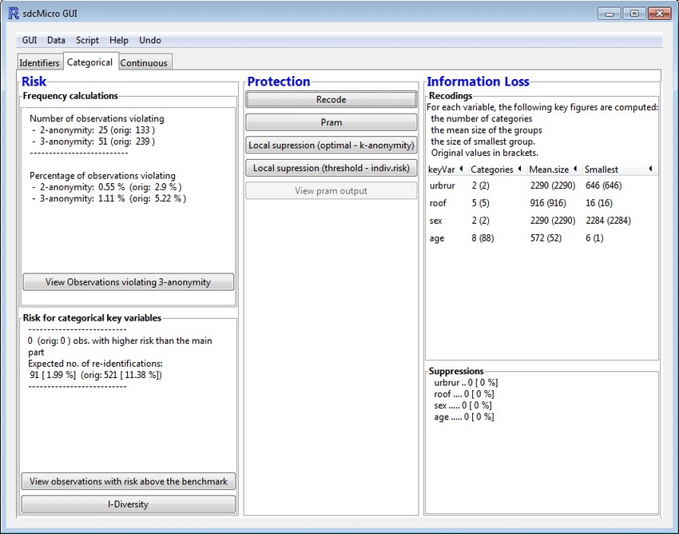

# sdcMicro

Link: [sdcMicro](https://cran.r-project.org/package=sdcMicro)

## Introduction

sdcMicro is a data anonymization tool that provides users with a powerful way to publish and share their sensitive data while maintaining the privacy of the individuals it contains. sdcMicro uses various statistical anonymization methods, including k-anonymity, to guarantee data privacy. Additionally, sdcMicro provides users with risk estimation tools that help ensure that the anonymized data meet privacy requirements.

## Features

- Supports k-anonymity
- Provides risk estimation tools
- Generates anonymized (micro)data

## Working Process

sdcMicro uses statistical methods to transform sensitive data into anonymous data. The user inputs the sensitive data into sdcMicro, and the tool applies k-anonymity to the data. The user then has the option to use the risk estimation tools to verify that the data meets privacy requirements. Once the data has been anonymized, sdcMicro outputs the anonymized data in a format that can be easily shared with others.

## Use Cases

Used in maintaining data confidentiality in statistical agencies and other institutions.
Part of CRAN Task View (contains a list of packages with methods typically used in official statistics and survey statistics)

## Conclusion

sdcMicro is a powerful data anonymization tool that provides users with a way to publish and share sensitive data while maintaining privacy. With its support for k-anonymity and risk estimation tools, sdcMicro ensures that the anonymized data meets privacy requirements. The tool is easy to use and has been applied in various industries, making it a valuable tool for anyone looking to share sensitive data in a privacy-preserving manner.
