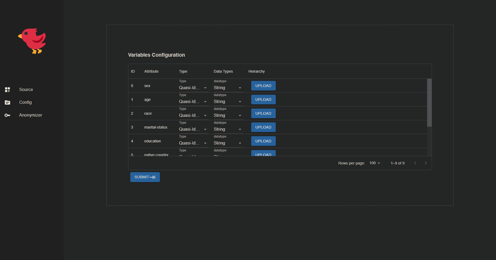
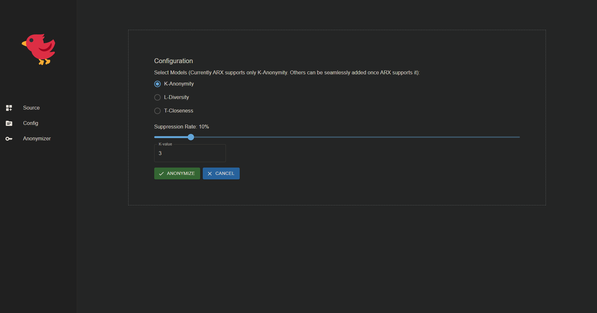
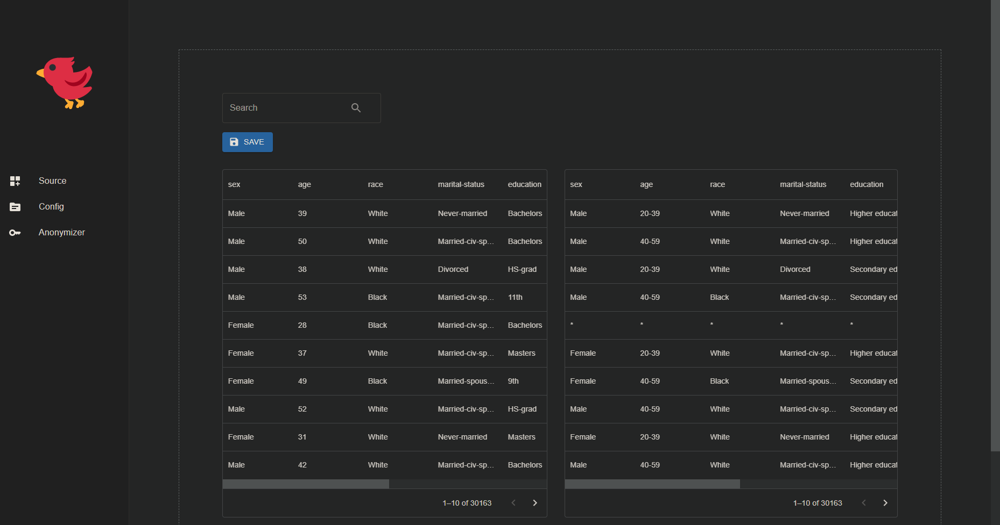

# User Story

As a user of the application, I want to be able to anonymize data so that sensitive information is not revealed. The process of anonymization will involve authentication, selection of data source, configuration of data and the use of a privacy model.

The following are the steps involved:

## 1: Data Sources

- Clicking on the Data Sources menu will redirect the user to the Data Sources page.
- The Data Sources page will contain a button for data sources to be uploaded by the user.
- The user is then given a list of attributes and options to set the attribute type, data type and upload generalization hierarchy.

## 2: Configure Variables

- A table will be displayed consisting of the attributes (columns) from the respective data source that was selected.
- For each attribute's information, a row will be given, so that the user needs to fill in.
- For each attribute, the attribute type should be selected i.e SENSITIVE, INSENSITIVE, IDENTIFYING, QUASI IDENTIFYING.
- Similarly, for data type, any of 'string', 'int' , 'dob' should be selected.
- For uploading generalization hierarchy, the user needs to upload by clicking the 'upload' button.
- After filling out the form, the user needs to click the 'next' button.

:::info
SENSITIVE: Sensitive attributes are those that are considered private and should not be disclosed to the public. For example, salary, medical records, etc.

INSENSITIVE: Insensitive attributes are those that are not considered private and can be disclosed to the public. For example, gender, age, etc.

IDENTIFYING: Identifying attributes are those that can be used to identify an individual. For example, name, address, etc.

QUASI IDENTIFYING: Quasi-identifying attributes are those that can be used to identify an individual when combined with other attributes. For example, zip code, date of birth, etc.
:::

## 3: Privacy Model Configurations

- Clicking on the Configurations menu will redirect the user to the Configurations page.
- The user needs to fill out the form with information related to the use of privacy model.
- The form will contain options for privacy models such as k-anonymity, l-diversity, t-closeness.
- The user needs to select the appropriate privacy model and fill out the required fields.
- After filling out the form, the user needs to click the 'Anonymize' button to start the process of anonymization.

## 4: Anonymize Data

- To anonymize the data, the user needs to go to the Anonymize page.
- It contain the original data vs the anonymized data.
- The user can download the anonymized data in by clicking on the 'save' button.

:::info
The privacy model typically used for anonymization algorithms involves generalizing and suppressing Quasi-identifier (QID) attributes. One popular algorithm is k-anonymity, which requires each QID tuple to appear in at least k-1 records to prevent re-identification. Generalization replaces values with similar but redundant ones, while suppression involves not publishing a value at all. However, k-anonymity has a vulnerability called the Homogeneity attack, where sensitive information is equal for all k individuals.

Another algorithm, l-diversity, requires high entropy on the distribution of sensitive attributes (SAs) for each QID. It balances dispersion of SAs between all groups in the dataset, providing trusted privacy against attacks even when collectors have no information about the attacker's level of knowledge. However, l-diversity is vulnerable to similarity attacks because it does not consider the semantic proximity of the values.

A new algorithm called t-closeness emerged due to previous models' vulnerabilities. It requires the SA distribution in any equivalence class to be similar to the attributes distribution in the overall dataset, decreasing the chances of learning individual's information. T-closeness uses the Earth Mover Distance metric and defines intervals to introduce and manage gaps between values of SAs.

Hierarchies are used to reduce the precision of attribute values, presenting data as intervals instead of simple values. They are used for categorical attributes and increase the utility of anonymized datasets. Hierarchies can be supplied by the user in CSV files, specifying the level of the hierarchy in the column headers and intervals or generalized attributes in the rows. The user needs to select a privacy model, such as k-anonymity, l-diversity, or t-closeness, and mention the suppression rate. After validating the data, the system generates a new configuration file in xml format that the user can select from the configuration card.
:::

## 5: Result

- After filling out all the required information in the wizard, the user can click on the 'Anonymize' button to start the anonymization process.
- The progress of the process will be displayed on the screen. Once the process is completed, the user will be redirected to the results page where the anonymized data will be displayed.
- The user can download the anonymized data by clicking on the 'save' button.

